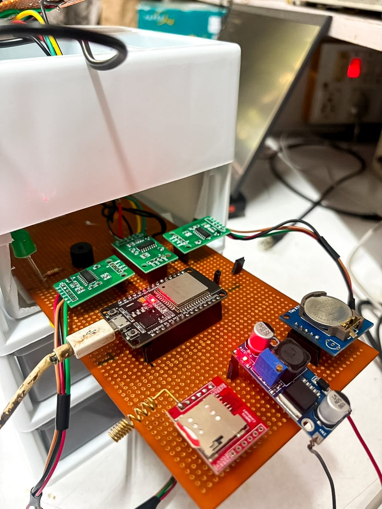
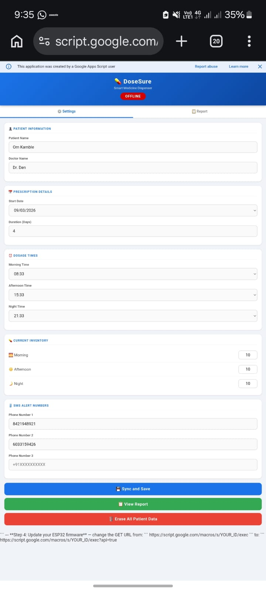
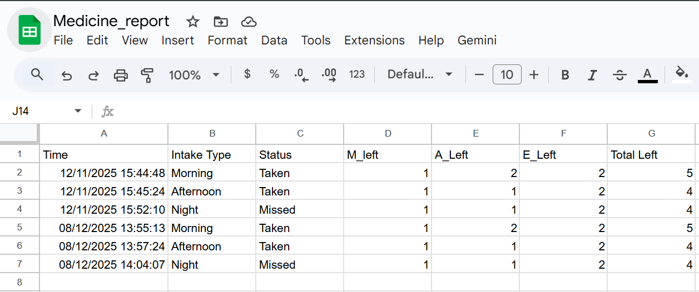

# Smart Medicine Dispenser – DoseSure

## Overview
DoseSure is an MSc Electronics project designed to improve medication adherence through scheduled reminders and dosage tracking. The system alerts users at predefined times and logs medication intake for monitoring and analysis.

---

## Objective
To develop a reliable embedded system that:
- Reminds users to take medication on time  
- Reduces missed or incorrect dosages  
- Maintains a log for tracking adherence  

---

## System Description
The system consists of an embedded ESP32 controller programmed in C++ that manages timing, alerts, and hardware interaction. A JavaScript-based web interface is used for logging and monitoring dosage data.

---
## Hardware Setup

  <b>Complete Setup</b> 
  

  <b>Circuit Connections</b> 
  

## Features
- Configurable medication schedule  
- Timely alerts and reminders  
- Dosage logging and tracking  
- Web interface for data logging (JavaScript)  

---

## Technologies Used
- C++ – Embedded system logic  
- JavaScript – Web interface for logging  
- Arduino IDE  

Hardware components:
- ESP32 Microcontroller  
- RTC module DS3231 
- Buzzer
- GSM SIM800L Module
- 1kg Loadcell + HX711 amplifiers  

---

## Working Principle
1. User sets medication timing  
2. System continuously tracks time  
3. At scheduled time, an alert is triggered(SMS)  
4. User acknowledges intake (Weight verification)  
6. Data is logged via the web interface  

---
<h2>System Input & Output Visuals</h2>

  <b>Dashboard Interface</b> 
  

  <b>Generated Report</b> 
  

## Future Scope
- Mobile app integration  
- IoT-based remote monitoring  
- Automated dispensing mechanism  
- Integration with healthcare systems  

---

## Applications
- Personal medication management  
- Elderly care systems  
- Hospital patient monitoring  

---

## Author
Denalven M.P. Sawian  
MSc Electronics
